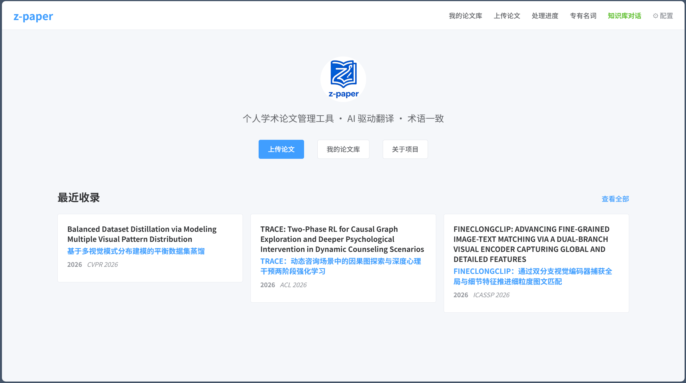
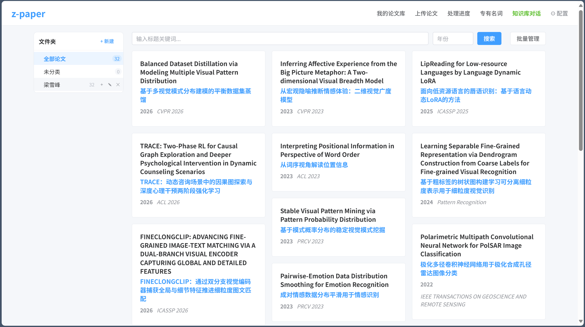
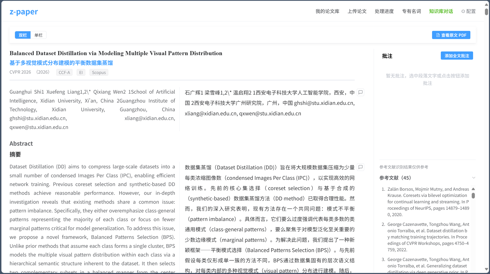
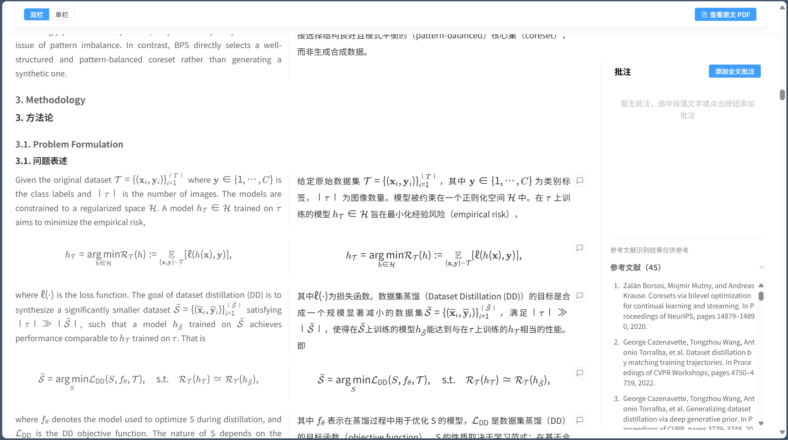
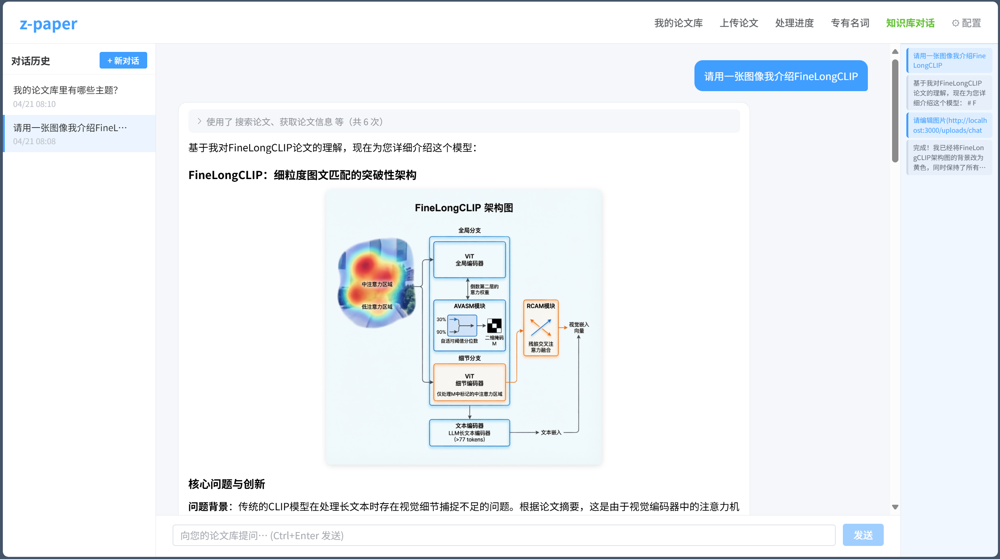

<div align="center">
  
  <p>A locally-deployed academic paper translation and AI knowledge base chat tool, designed for individual researchers.</p>
  <p>中文 | <a href="README.md">English</a></p>
</div>

All data is stored locally. No external database or message queue required.

---

## Screenshots

<table>
  <tr>
    <td><br/><sub>Home</sub></td>
    <td><br/><sub>Paper Library · Virtual Folders</sub></td>
  </tr>
  <tr>
    <td><br/><sub>Bilingual Reading View</sub></td>
    <td><br/><sub>LaTeX Formula Rendering</sub></td>
  </tr>
  <tr>
    <td colspan="2"><br/><sub>AI Knowledge Base Chat · Image Generation</sub></td>
  </tr>
</table>

---

## Installation (Windows)

> ⚠️ **The Baidu Netdisk installer is outdated and no longer maintained.**  
> Installing from source is recommended — just two commands to get started (see Quick Start below).

**Baidu Netdisk (old version, for reference only):** https://pan.baidu.com/s/1ZdRe2TixlulmjIyZI0UEzQ?pwd=6zqp  Code: 6zqp

---

## 1. Precise Translation

The core challenge of academic paper translation is not language — it is **terminology consistency** and **layout preservation**. z-paper addresses both with a six-stage parallel pipeline.

```
Upload PDF
  → Duplicate detection (title similarity check against existing papers)
  → MinerU parsing (multi-column / formula / table / figure caption detection)
  → Parallel text cleaning (8 concurrent): merge PDF line breaks, fix OCR errors, normalize LaTeX
  → Term extraction: automatically identify domain-specific terminology
  → [PAUSE] User reviews new terms — confirm translation strategy per term
      (translate / keep original / translate + annotate with original)
  → Parallel paragraph translation (8 concurrent, DeepSeek) + image translation (3 concurrent, Qwen)
  → Generate bilingual output
```

**Key Design: Terminology Review Checkpoint**

Most translation tools translate terminology randomly, causing the same term to appear under different names throughout a paper. z-paper forces a pause before translation begins, requiring the user to confirm how each new term should be handled. Confirmed terms are saved to a personal glossary and reused automatically in all future translations, ensuring consistency across the entire document.

**Two-Layer Vocabulary System**

- **Personal glossary**: applies across all papers, with custom handling strategy per term
- **Domain glossary**: 11 preset disciplines (Computer Science, Mathematics, Physics, Biology, etc.) as shared reference
- Each translation snapshots the glossary state, making results reproducible

**Reading Experience**

- Chinese/English side-by-side, switchable to single-column
- LaTeX math formulas rendered with KaTeX
- Image lightbox with original vs. translated comparison
- In-text citations `[1]` clickable, jump to reference list
- Paragraph-level annotation system

---

## 2. Knowledge Base Chat

### Design Philosophy: Tools First, Not Context Stuffing

Most "paper Q&A" products work via RAG: retrieve text chunks and stuff them into the context. This approach has a hard ceiling — answer quality is limited by retrieval quality, and the model has no ability to explore proactively.

z-paper's design is inspired by **[Claude Code](https://claude.ai/code)**: **instead of deciding in advance what to show the model, equip the Agent with tools and let it decide at each step what to read and how much**. Context is a scarce resource; an Agent's value lies in knowing how to use it efficiently.

### Two Key Separations

**Location vs. Content**

Tool results do not need to permanently occupy context. During compression, only the index is kept (what was found and where) — the full text is discarded. It can always be retrieved again on demand. This mirrors how humans read papers: you don't memorize the whole paper, but you remember "Section 3 covered this — let me go back."

**Search vs. Read**

Search tools locate; read tools deep-read. The Agent first locates, then reads on demand — rather than loading everything upfront.

### 14 Tools Covering Navigation and Creation

| Tool | Function |
| --- | --- |
| `search_papers` | Search the full library by title / abstract / keywords |
| `get_paper_outline` | Get a paper's section outline |
| `get_paper_metadata` | Quickly retrieve abstract / authors / keywords |
| `search_in_paper` | Keyword search within a single paper's full text |
| `search_across_papers` | **Cross-library** full-text search across all papers at once |
| `get_paper_section` | Retrieve a section's **complete text** (no paragraph limit) |
| `get_paragraph_context` | Get surrounding paragraphs around a matched block |
| `get_references` | Retrieve the reference list |
| `get_annotations` | Get all personal annotations for a paper |
| `search_annotations` | **Cross-library** annotation search (Chinese tokenization + pinyin) |
| `search_chat_history` | Search historical conversation records |
| `query_database` | Execute custom SQL queries (last resort for complex queries) |
| `generate_image` | Generate images from descriptions (visualize concepts / workflows) |
| `edit_image` | Edit an existing image with natural language instructions |

The Agent autonomously decides which tools to call and how many times, outputting an answer only when it judges the information sufficient. There is no fixed flow — call strategy is entirely model-driven.

### AI Image Generation

You can ask the Agent to generate diagrams directly in chat, e.g. "Draw a diagram explaining the attention mechanism in Transformers." The Agent calls `generate_image` and embeds the result inline. Images support:

- Click to enlarge, scroll wheel zoom (0.5× – 5×), drag to pan when zoomed
- One-click download
- Click "Edit image" to provide instructions; the Agent calls `edit_image` to revise

### Two-Layer Memory Architecture

- **L1 Working memory**: current conversation context, automatically injected with paper directory and personal glossary each turn
- **L2 Cold storage**: all historical conversations persisted locally; Agent retrieves via `search_chat_history` on demand. Sessions are fully isolated to prevent stale conclusions from polluting new conversations

### Five-Level Context Compression for Long Research Sessions

| Level | Trigger | Action | API Cost |
| --- | --- | --- | --- |
| L1 Snip | >4 turns | Compress old tool results to structural index (keep location, discard body) | None |
| L2 Micro | >8 turns | Fold old tool call pairs into one-line summaries | None |
| L3 Fold | >12 turns | Truncate old message content | None |
| L4 Auto | >16 turns | LLM generates full summary to replace old turns | Yes |
| L5 Emergency | >80K chars | Force-keep last 3 turns only | None |

Circuit breaker: L4 stops retrying after 3 consecutive failures to avoid wasting API calls.

### Additional Details

- **Bilingual search**: Chinese queries automatically search both Chinese and English keywords; Chinese names also try pinyin variants to maximize recall
- **Streaming output**: tool call phase uses non-streaming for reliable JSON; final answer streams via SSE with real-time tool call display
- **Citation tracing**: every answer includes citation cards — clicking one opens the source paper and **auto-scrolls to the exact paragraph** (block-level precision)
- **Session minimap**: a thumbnail navigation bar on the right side of the chat page tracks your current position in real time

---

## Tech Stack

| Layer | Technology | Notes |
| --- | --- | --- |
| Backend | FastAPI + Uvicorn | Async HTTP + WebSocket for real-time progress |
| Database | SQLite (WAL mode) | Zero dependencies, no database service needed |
| ORM | SQLAlchemy 2.0 | |
| Async | Python asyncio | No Celery / Redis — pure thread pool concurrency |
| Frontend | Vue 3 + Vite 5 | |
| UI Components | Element Plus | |
| Formula Rendering | KaTeX | |
| Translation LLM | DeepSeek Chat | Paragraph translation + Agent conversation |
| Vision LLM | Qwen3-VL-Flash / Qwen-Image-2.0-Pro / Qwen-Image-2.0 | OCR + image translation + image generation |
| PDF Parsing | MinerU API | |

---

## Quick Start (Source)

**Requirements:** Python 3.11+, Node.js 18+

```bash
git clone https://github.com/yuan2001425/z-paper.git
cd z-paper

# Windows
start.bat

# Linux / macOS
bash start.sh
```

On first launch, you will be redirected to the settings page. Enter three API keys:

| Key | Purpose | Get it |
| --- | --- | --- |
| DeepSeek API Key | Translation + chat | https://platform.deepseek.com |
| Qwen API Key | OCR + text processing + image generation | https://dashscope.console.aliyun.com |
| MinerU API Key | PDF parsing | https://mineru.net |

---

## Data

All data is stored entirely on your machine: `backend/data/zpaper.db` (database) and `backend/uploads/` (files). Back up these two directories to fully migrate your data.

---

## Changelog

### v1.2.0
- **Virtual folders**: multi-level paper organization (up to 3 levels), tree navigation, batch move; delete with "keep papers" or "delete files" strategy
- **Batch upload**: select multiple PDFs at once, per-paper metadata entry with auto-extraction, duplicate detection, confirm/skip per paper, submit all at once
- **Bulk management**: multi-select papers and move to folder in one action

### v1.1.0
- **In-chat image generation**: new `generate_image` / `edit_image` tools; image viewer with scroll-wheel zoom and drag-to-pan
- **Duplicate detection**: title similarity check before upload to prevent duplicates
- **Paper library**: masonry layout, lazy loading, independent card heights
- **PDF metadata extraction**: fix for large files hanging

### v1.0.0
- Initial release

---

## License

MIT
