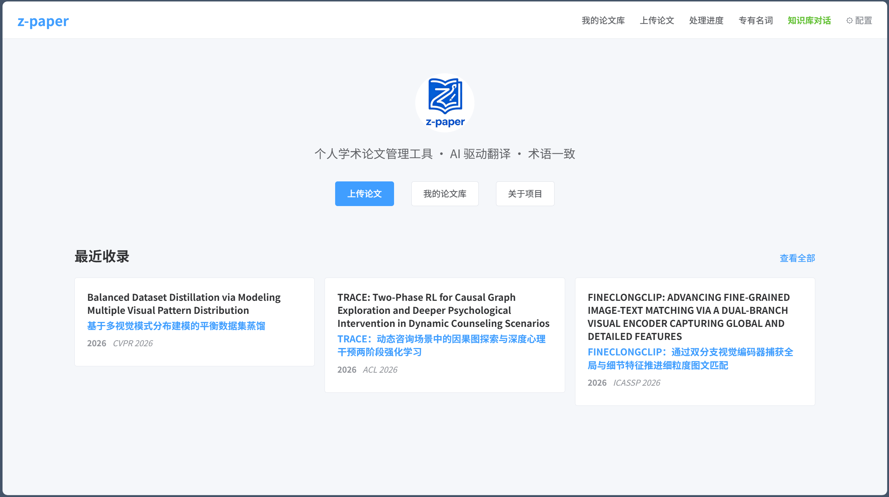
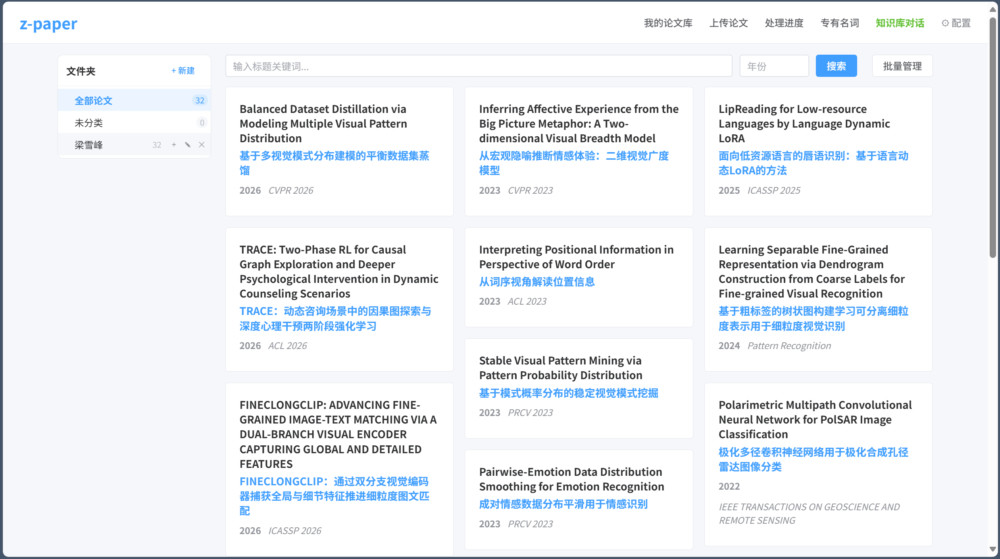
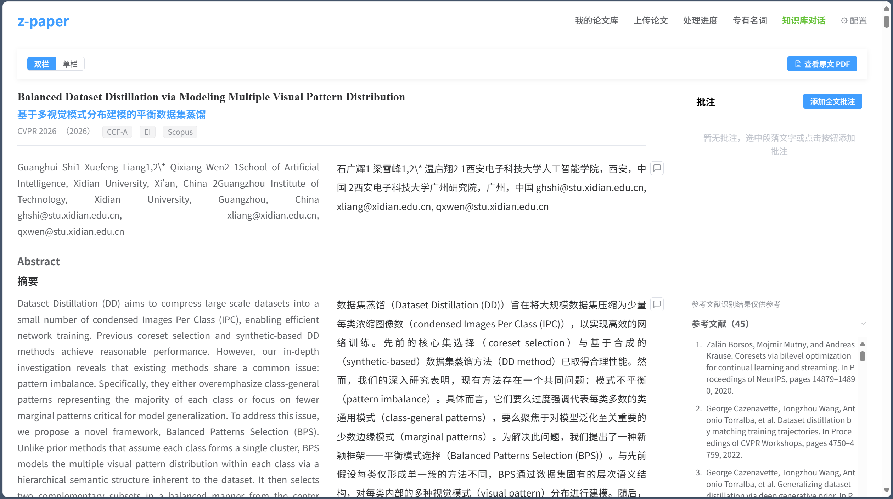
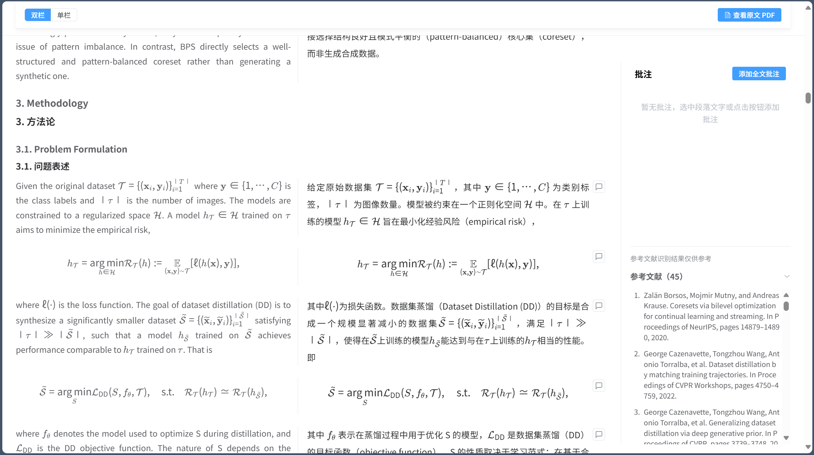
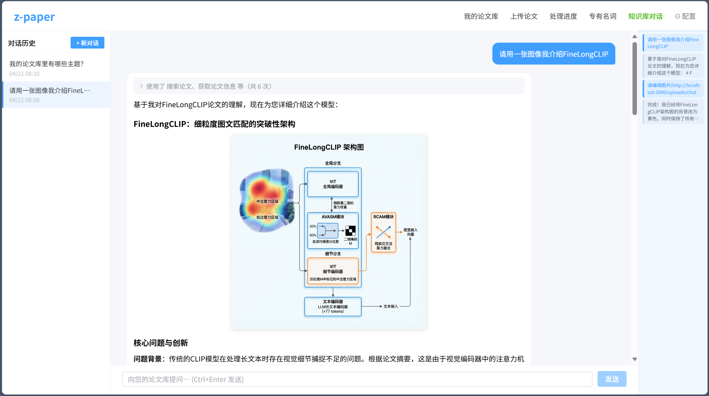

<div align="center">
  
  <p>A locally-deployed academic paper translation and AI knowledge base chat tool, designed for individual researchers.</p>
  <p>中文 | <a href="README.md">English</a></p>
</div>

All data is stored locally. No external database or message queue required.

---

## Screenshots

<table>
  <tr>
    <td><br/><sub>Home</sub></td>
    <td><br/><sub>Paper Library · Virtual Folders</sub></td>
  </tr>
  <tr>
    <td><br/><sub>Bilingual Reading View</sub></td>
    <td><br/><sub>LaTeX Formula Rendering</sub></td>
  </tr>
  <tr>
    <td colspan="2"><br/><sub>AI Knowledge Base Chat · Image Generation</sub></td>
  </tr>
</table>

---

## Installation (Windows)

> ⚠️ **The Baidu Netdisk installer is outdated and no longer maintained.**  
> Installing from source is recommended — just two commands to get started (see Quick Start below).

**Baidu Netdisk (old version, for reference only):** https://pan.baidu.com/s/1ZdRe2TixlulmjIyZI0UEzQ?pwd=6zqp  Code: 6zqp

---

## 1. Precise Translation

The core challenge of academic paper translation is not language — it is **terminology consistency** and **layout preservation**. z-paper addresses both with a six-stage parallel pipeline.

```
Upload PDF
  → Duplicate detection (title similarity check against existing papers)
  → MinerU parsing (multi-column / formula / table / figure caption detection)
  → Parallel text cleaning (8 concurrent): merge PDF line breaks, fix OCR errors, normalize LaTeX
  → Term extraction: automatically identify domain-specific terminology
  → [PAUSE] User reviews new terms — confirm translation strategy per term
      (translate / keep original / translate + annotate with original)
  → Parallel paragraph translation (8 concurrent, DeepSeek) + image translation (3 concurrent, Qwen)
  → Generate bilingual output
```

**Key Design: Terminology Review Checkpoint**

Most translation tools translate terminology randomly, causing the same term to appear under different names throughout a paper. z-paper forces a pause before translation begins, requiring the user to confirm how each new term should be handled. Confirmed terms are saved to a personal glossary and reused automatically in all future translations, ensuring consistency across the entire document.

**Two-Layer Vocabulary System**

- **Personal glossary**: applies across all papers, with custom handling strategy per term
- **Domain glossary**: 11 preset disciplines (Computer Science, Mathematics, Physics, Biology, etc.) as shared reference
- Each translation snapshots the glossary state, making results reproducible

**Reading Experience**

- Chinese/English side-by-side, switchable to single-column
- LaTeX math formulas rendered with KaTeX
- Image lightbox with original vs. translated comparison
- In-text citations `[1]` clickable, jump to reference list
- Paragraph-level annotation system
- **One-click DOCX export**: three modes (original / translation / original+translation), auto-embed images, LaTeX formulas rendered as native Word math equations (OMML), narrow margins for compact layout

---

## 2. Knowledge Base Chat

### Design Philosophy: Tools First, Not Context Stuffing

Most "paper Q&A" products work via RAG: retrieve text chunks and stuff them into the context. This approach has a hard ceiling — answer quality is limited by retrieval quality, and the model has no ability to explore proactively.

z-paper's design is inspired by **[Claude Code](https://claude.ai/code)**: **instead of deciding in advance what to show the model, equip the Agent with tools and let it decide at each step what to read and how much**. Context is a scarce resource; an Agent's value lies in knowing how to use it efficiently.

### Two Key Separations

**Location vs. Content**

Tool results do not need to permanently occupy context. During compression, only the index is kept (what was found and where) — the full text is discarded. It can always be retrieved again on demand. This mirrors how humans read papers: you don't memorize the whole paper, but you remember "Section 3 covered this — let me go back."

**Search vs. Read**

Search tools locate; read tools deep-read. The Agent first locates, then reads on demand — rather than loading everything upfront.

### 14 Tools Covering Navigation and Creation

| Tool | Function |
| --- | --- |
| `search_papers` | Search the full library by title / abstract / keywords |
| `get_paper_outline` | Get a paper's section outline |
| `get_paper_metadata` | Quickly retrieve abstract / authors / keywords |
| `search_in_paper` | Keyword search within a single paper's full text |
| `search_across_papers` | **Cross-library** full-text search across all papers at once |
| `get_paper_section` | Retrieve a section's **complete text** (no paragraph limit) |
| `get_paragraph_context` | Get surrounding paragraphs around a matched block |
| `get_references` | Retrieve the reference list |
| `get_annotations` | Get all personal annotations for a paper |
| `search_annotations` | **Cross-library** annotation search (Chinese tokenization + pinyin) |
| `search_chat_history` | Search historical conversation records |
| `query_database` | Execute custom SQL queries (last resort for complex queries) |
| `generate_image` | Generate images from descriptions (visualize concepts / workflows) |
| `edit_image` | Edit an existing image with natural language instructions |

The Agent autonomously decides which tools to call and how many times, outputting an answer only when it judges the information sufficient. There is no fixed flow — call strategy is entirely model-driven.

### AI Image Generation

You can ask the Agent to generate diagrams directly in chat, e.g. "Draw a diagram explaining the attention mechanism in Transformers." The Agent calls `generate_image` and embeds the result inline. Images support:

- Click to enlarge, scroll wheel zoom (0.5× – 5×), drag to pan when zoomed
- One-click download
- Click "Edit image" to provide instructions; the Agent calls `edit_image` to revise

### Two-Layer Memory Architecture

- **L1 Working memory**: current conversation context, automatically injected with paper directory and personal glossary each turn
- **L2 Cold storage**: all historical conversations persisted locally; Agent retrieves via `search_chat_history` on demand. Sessions are fully isolated to prevent stale conclusions from polluting new conversations

### Five-Level Context Compression for Long Research Sessions

| Level | Trigger | Action | API Cost |
| --- | --- | --- | --- |
| L1 Snip | >4 turns | Compress old tool results to structural index (keep location, discard body) | None |
| L2 Micro | >8 turns | Fold old tool call pairs into one-line summaries | None |
| L3 Fold | >12 turns | Truncate old message content | None |
| L4 Auto | >16 turns | LLM generates full summary to replace old turns | Yes |
| L5 Emergency | >80K chars | Force-keep last 3 turns only | None |

Circuit breaker: L4 stops retrying after 3 consecutive failures to avoid wasting API calls.

### Additional Details

- **Bilingual search**: Chinese queries automatically search both Chinese and English keywords; Chinese names also try pinyin variants to maximize recall
- **Streaming output**: tool call phase uses non-streaming for reliable JSON; final answer streams via SSE with real-time tool call display
- **Citation tracing**: every answer includes citation cards — clicking one opens the source paper and **auto-scrolls to the exact paragraph** (block-level precision)
- **Session minimap**: a thumbnail navigation bar on the right side of the chat page tracks your current position in real time

---

## Tech Stack

| Layer | Technology | Notes |
| --- | --- | --- |
| Backend | FastAPI + Uvicorn | Async HTTP + WebSocket for real-time progress |
| Database | SQLite (WAL mode) | Zero dependencies, no database service needed |
| ORM | SQLAlchemy 2.0 | |
| Async | Python asyncio | No Celery / Redis — pure thread pool concurrency |
| Frontend | Vue 3 + Vite 5 | |
| UI Components | Element Plus | |
| Formula Rendering | KaTeX | |
| Translation LLM | DeepSeek Chat | Paragraph translation + Agent conversation |
| Vision LLM | Qwen3-VL-Flash / Qwen-Image-2.0-Pro / Qwen-Image-2.0 | OCR + image translation + image generation |
| PDF Parsing | MinerU API | |

---

## Quick Start (Source)

**Requirements:** Python 3.11+, Node.js 18+

```bash
git clone https://github.com/yuan2001425/z-paper.git
cd z-paper

# Windows
start.bat

# Linux / macOS
bash start.sh
```

On first launch, you will be redirected to the settings page. Enter three API keys:

| Key | Purpose | Get it |
| --- | --- | --- |
| DeepSeek API Key | Translation + chat | https://platform.deepseek.com |
| Qwen API Key | OCR + text processing + image generation | https://dashscope.console.aliyun.com |
| MinerU API Key | PDF parsing | https://mineru.net |

---

## Data

All data is stored entirely on your machine: `backend/data/zpaper.db` (database) and `backend/uploads/` (files). Back up these two directories to fully migrate your data.

### Same-WLAN Data Sync

When two computers are on the same WLAN and both are running z-paper, open the bottom section of the Settings page to sync data:

1. On the receiver, click "Enable discovery" so it can be found by devices on the same WLAN for a short time.
2. On the sender, click "Scan devices", select the receiver, and send a sync request.
3. On the receiver, approve the pending request. The UI shows manifest comparison, packaging, transfer, and import logs.

Both devices must run the same z-paper sync version. The sync includes API settings, the paper library, translation results, annotations, chat history, glossaries, folders, and uploaded files. z-paper compares source and receiver manifests first, then packages only database rows and uploaded files missing from the receiver; uploaded files are compared by relative path, size, and SHA-256 fingerprint, and same-path files with different content are treated as conflicts and skipped without overwriting the receiver. API settings are updated from the source. The receiver's existing database is backed up first under `backend/data/sync_backups/`.

If discovery cannot find the other device, check that the system firewall allows z-paper / Python / uvicorn on the local network and permits TCP `8000` plus UDP `37621`. Sync works in both packaged production mode and source development mode; in development mode another computer may open `http://<this-computer-ip>:3000`, while sync APIs still use backend port `8000`.

---

## Changelog

### v2.2.1
- **Known bug fixes**: Fixed Same-WLAN sync failures caused by very long PDF filenames being extracted under Windows temporary directories. Sync bundles now store files under short internal paths and restore original upload paths through the manifest.
- **More tolerant sync import**: Export skips upload files that are already missing on the source device. Import records and skips individual missing bundle files instead of failing the whole 800 MB-class sync.
- **Version check update**: Same-WLAN sync version is now `2.2.1`; both computers need the same version before syncing.

### v2.2.0
- **Same-WLAN data sync**: The receiver enables discovery, then the sender scans available z-paper devices on the same WLAN and sends a request without manually entering the target address.
- **Differential sync**: z-paper compares source and receiver manifests first and packages only database rows and uploaded files missing from the receiver; same-path uploaded files with different content are skipped as conflicts to avoid overwriting existing PDFs.
- **Version checks and interactive progress**: Sync requires matching versions and shows frontend progress, logs, and errors during transfer and import.
- **Receiver approval and backup**: The receiver must approve the transfer manually. The receiver database is backed up to `backend/data/sync_backups/`, and sync is blocked while parsing or translation jobs are running.
- **LAN-ready startup**: Windows, Linux/macOS startup scripts and the Vite dev server now listen on LAN addresses by default.
- **Known bug fixes**: Fixed packaged discovery returning 500 on Chinese Windows network output, stale backend services surviving overwrite installs, and the redundant "Refresh page" button after a successful import.

### v2.1.0
- **Restart failed jobs**: Failed short-document jobs now show a "Restart" button in the job list, reusing the original PDF to rerun parsing plus translation or Chinese archiving.
- **Retry long-document chapters**: The long-document detail page can restart a single failed chapter, and a failed parent long document can restart all failed chapters at once before continuing the merged result workflow.
- **Retry safety**: Restart is available only for failed jobs. Before rerunning, the system clears stale error state and old results for that job without creating duplicate paper records or changing the privacy ignore rules for `backend/uploads/` and `backend/data/`.

### v2.0.0
- **Long document mode**: English upload, Chinese upload, and batch upload can mark a PDF as a long document. Long documents are saved as parent drafts first and do not immediately enter parsing or translation.
- **Manual chapter splitting**: The new chapter page lets users define page ranges, preview page thumbnails, and validate out-of-range pages, reversed ranges, and overlapping chapters. Uncovered cover or table-of-contents pages are skipped intentionally.
- **Chapter queue processing**: After confirmation, PyMuPDF splits the original PDF into chapter PDFs, and each chapter enters the existing English translation or Chinese archive queue.
- **Merged parent result**: Once every chapter finishes, the parent document gets a merged reading result with chapter headings, body content, document memory, and deduplicated references. Library views hide internal chapter papers by default.
- **Privacy and storage**: Uploaded files, chapter PDFs, and the local database remain under `backend/uploads/` and `backend/data/`, both of which stay ignored by Git.

### v1.4.0
- **Long-document translation memory**: builds a compact per-document memory after structure analysis, including the outline, section context, abbreviations, symbols, recurring concepts, and applicable glossary entries. Each paragraph translation now receives only the relevant local context, improving terminology consistency and cross-section continuity without changing PDF parsing.

### v1.3.0
- **DOCX export**: one-click export from reading view; three modes (original / translation / original+translation); auto-embeds images and renders LaTeX as native Word math equations (OMML); narrow margins for compact layout; filename auto-labeled `{Chinese title}(mode).docx`

### v1.2.0
- **Virtual folders**: multi-level paper organization (up to 3 levels), tree navigation, batch move; delete with "keep papers" or "delete files" strategy
- **Batch upload**: select multiple PDFs at once, per-paper metadata entry with auto-extraction, duplicate detection, confirm/skip per paper, submit all at once
- **Bulk management**: multi-select papers and move to folder in one action

### v1.1.0
- **In-chat image generation**: new `generate_image` / `edit_image` tools; image viewer with scroll-wheel zoom and drag-to-pan
- **Duplicate detection**: title similarity check before upload to prevent duplicates
- **Paper library**: masonry layout, lazy loading, independent card heights
- **PDF metadata extraction**: fix for large files hanging

### v1.0.0
- Initial release

---

## License

MIT
